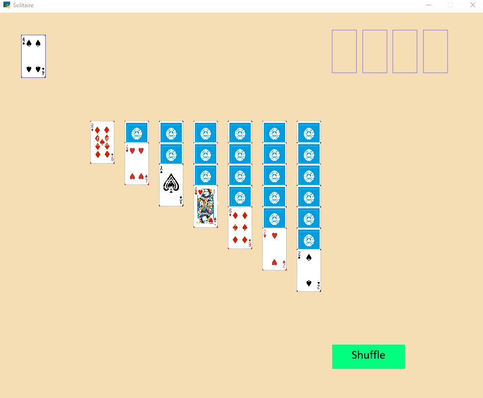

# Solitaire

Recreating the Solitaire card game using the Python Arcade library. In this project, in order to avoid creating and managing each of the 52 cards in a card deck individually, I created a custom 'Playing_Card' class to create card objects and allow the addition of new functionalities/features with ease.

<!--## Visuals/Demo-->

## Installation
Make sure to install the required Python arcade library by typing the following in your command line interface (CLI):

    pip install arcade

Now you may clone this repository using:

    git clone https://github.com/Iliaromanov/Solitaire.git

*Make sure to configure git beforehand.

Finally, you may run the program in your IDE of choice. Enjoy!

