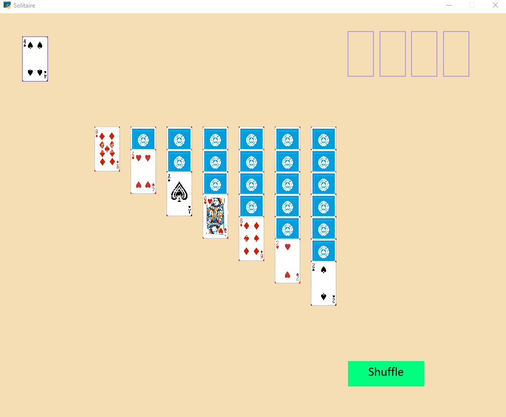

<!-- -->

#  Solitaire

Solitaire card game built with the help of the Python Arcade library.<!-- In this project, to avoid creating and managing each of the 52 cards in a card deck individually, I implemented a custom 'Playing_Card' Python class to automate card object creation as well as other card related functionalities.-->

 

## Visuals/Demo

## ⚙ Installation
1. Install the required Python arcade library:

        pip install arcade

<!--*Make sure you are using Python version <= 3.8.7-->

2. Clone this repository using:

        git clone https://github.com/Iliaromanov/Solitaire.git

<!--*Make sure to configure git beforehand.

You are now all set! Enjoy!🎉-->

